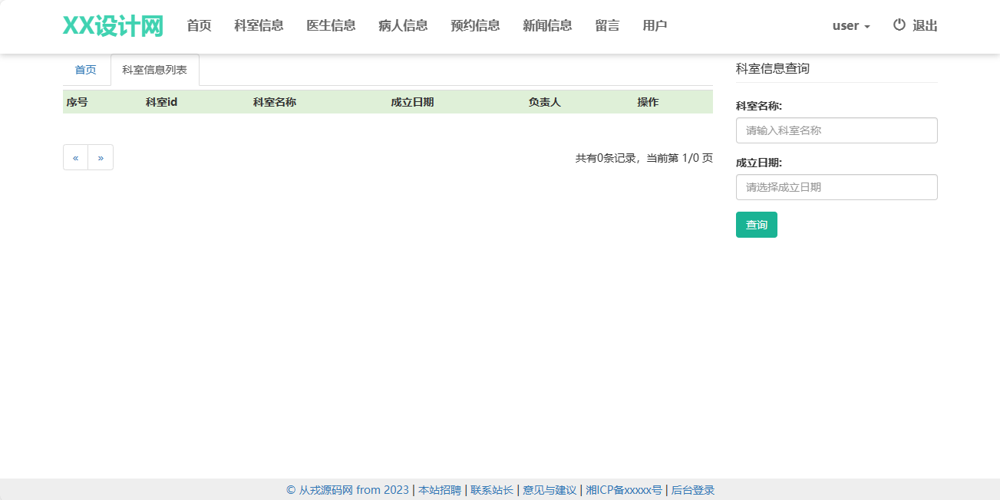
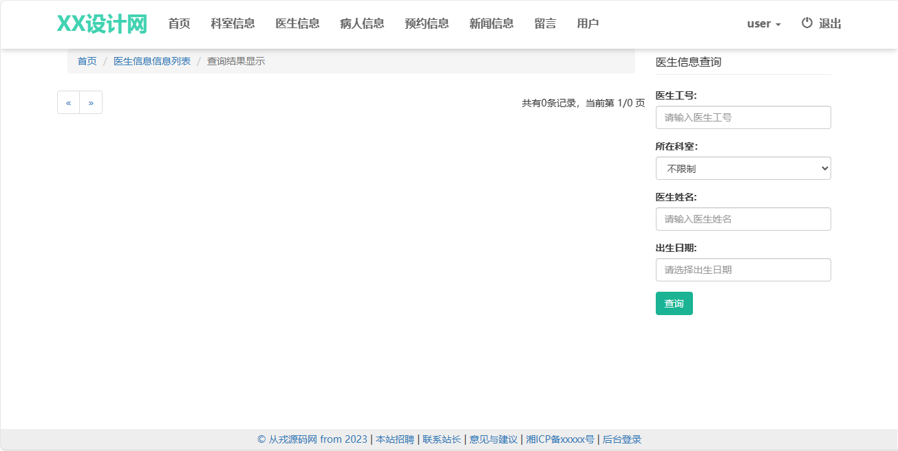
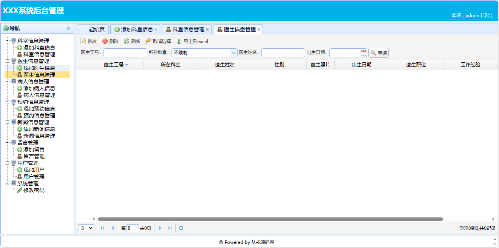
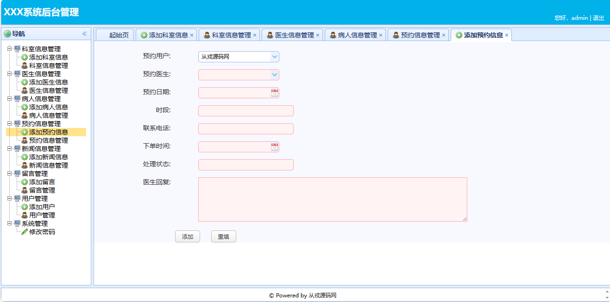
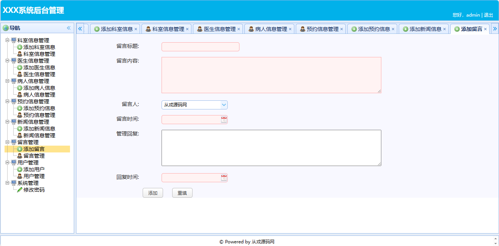

<h1 align="center">46.基于ssm的医院预约管理系统</h1>

###  获取sql数据库文件: 从戎源码网 (https://armycodes.com/) QQ: 386869957 QQ群: 377586148 
###  所有系统地址: (https://github.com/YuLin-Coder/AllProjectCatalog)
###  所有项目以及源代码本人均调试运行无问题 可支持远程安装部署调试、定制修改、代码讲解

## 简介

> 本代码来源于网络,仅供学习参考使用!
> 
> 用户端：http://localhost:8080/
> user 1
> 
> 管理后台：http://localhost:8080/
> admin 1
> 

## 项目介绍
基于ssm的医院预约管理系统：前端jsp、jquery、bootstrap、easyui，后端 spring、mybatis，集成科室信息、医生信息、病人信息、预约信息等功能于一体的系统。

## 功能介绍

### 用户

- 基本功能：登录、注册、退出
- 首页：轮播图、列表模块展示、导航栏
- 科室信息：科室信息列表、关键词搜索、科室详情
- 医生信息：医生信息列表、关键词搜索、医生详情
- 病人信息：病人信息列表、关键词搜索、病人详情
- 预约信息：预约信息列表、关键词搜索、预约详情
- 新闻信息：新闻信息列表、关键词搜索、新闻详情
- 留言信息：留言信息列表、关键词搜索、留言详情
- 用户信息：用户详情

### 管理员

- 科室信息管理：添加科室信息、科室信息列表、修改、删除、导出excel、关键词查询
- 医生信息管理：添加医生信息、医生信息列表、修改、删除、导出excel、关键词查询
- 病人信息管理：添加病人信息、病人信息列表、修改、删除、导出excel、关键词查询
- 预约信息管理：添加预约信息、预约信息列表、修改、删除、导出excel、关键词查询
- 新闻信息管理：添加新闻信息、新闻信息列表、修改、删除、导出excel、关键词查询
- 留言信息管理：添加留言信息、留言信息列表、修改、删除、导出excel、关键词查询
- 用户信息管理：添加用户信息、用户信息列表、修改、删除、导出excel、关键词查询

## 环境

- <b>IntelliJ IDEA 2009.3</b>

- <b>Mysql 5.7.26</b>

- <b>Maven</b>

- <b>JDK 1.8</b>

## 运行截图

